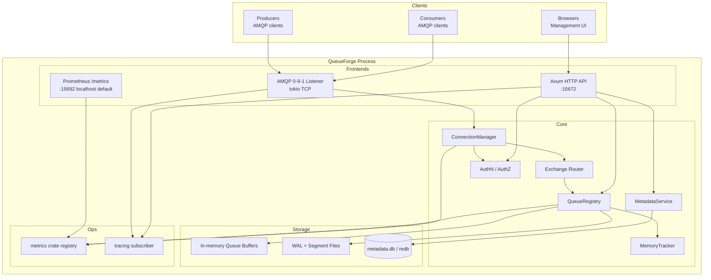
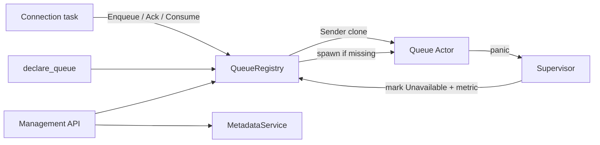
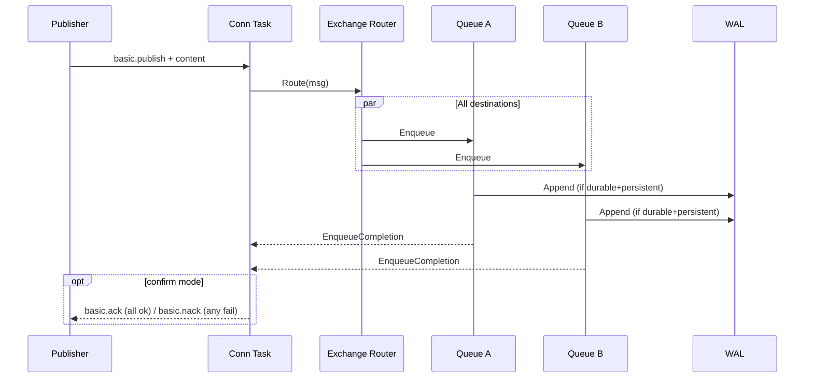
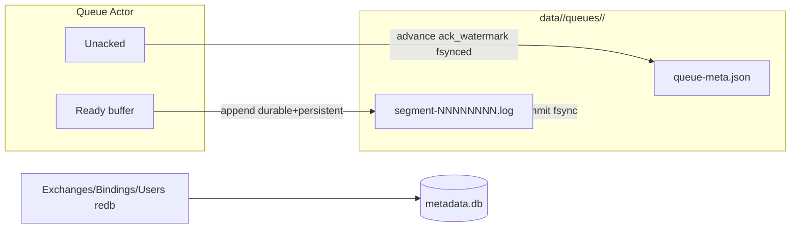

# QueueForge — High-Performance Message Queue Broker in Rust

> **Historical design / architecture reference.** This document captures the
> original system design and PR plan. **Implementation now exists in this
> monorepo** — single-node v0.1 feature set is **implemented** (AMQP pub/sub,
> routing, durability, priority, TTL/DLX, management CRUD + SPA, TLS, metrics,
> bench). Prefer [`README.md`](README.md), [`docs/RELEASE_NOTES.md`](docs/RELEASE_NOTES.md),
> and the crate sources for current behavior; do not treat every design “TBD” or
> pre-implementation note below as live product status.

> **User decisions incorporated 2026-07-20:** product renamed to **QueueForge**; **message priority is in v1** (must-have); **Java client is optional** for CI (lapin + pika required). Open questions closed. Document status: historical (implementation landed).

| Field | Value |
|-------|-------|
| **Document Title** | QueueForge System Design |
| **Author** | TBD |
| **Date** | 2026-07-20 |
| **Status** | Historical design reference — **implemented** (single-node v0.1) |
| **Version** | 0.5 |
| **Audience** | Senior engineers implementing the system |

---

## Overview

QueueForge is a greenfield, high-performance message queue broker written entirely in Rust, inspired by RabbitMQ’s conceptual model (exchanges—including the default exchange—queues, bindings, acknowledgements, durability, prefetch, dead-lettering) but deliberately scoped for a realistic delivery plan:

| Release | Scope | Approx. effort |
|---------|--------|----------------|
| **0.1 Vertical slice** | Through **PR 7b + PR 13a (minimal)**: AMQP connect → declare → publish via **default exchange `""` only** → consume → ack; in-memory; auth; health/metrics; read-only management lists (no SPA, no user fanout/topic routing) | **~8–12 engineer-weeks** (1–2 engineers) |
| **0.2 Durable + ops** | Starts at **PR 8**: user direct/fanout/topic + multi-dest; then WAL, confirms, **priority queues**, TTL/DLX, full management API + SPA, TLS, limits | **+12–20 engineer-weeks** |
| **1.0** | Hardening, client matrix green, documented SLOs validated | **+4–6 engineer-weeks** |

**v1 product** in this document means through **1.0** (single-node, durable, UI). Stretch throughput numbers are **hypotheses** validated in the bench PR—not contractual promises.

The broker core runs on Tokio with per-queue and per-connection tasks. Persistence: durable queues use a segmented WAL with group-commit fsync; transient queues stay in memory. Management plane: Axum HTTP/JSON + embedded React SPA. Multi-tenancy: virtual hosts with user/permission ACLs.

**Product name:** **QueueForge** (final). **License:** MIT OR Apache-2.0 dual. Repository: Cargo workspace monorepo; pin crate versions from PR 1 (`Cargo.lock` committed). Workspace at design time was empty (`/workspace`); no legacy integration.

---

## Background & Motivation

### Why build this?

1. **Operational control** — Self-hosted, inspectable broker with a modern management UI and predictable Rust latency tails (no GC pauses).
2. **Differentiation** — RabbitMQ is mature but Erlang-centric; a Rust broker enables single-binary deploy and a co-located management stack.
3. **Greenfield** — Empty workspace; choose MVP features intentionally rather than full RabbitMQ parity on day one.

### Pain points we address

| Pain point | How QueueForge addresses it |
|------------|---------------------------|
| Opaque broker internals | Explicit architecture, metrics, and UI for every resource |
| GC / runtime latency jitter | Rust + Tokio; avoid global locks; partition by queue |
| Heavy multi-binary ops | Single broker binary + static SPA assets |
| Ecosystem lock-in | AMQP 0-9-1 client compatibility |

### Current state

No existing code. This document defines architecture, crates, protocol choice, persistence, UI stack, SLOs, rollout, and an ordered PR plan. When implementation starts, **pin dependency versions in PR 1** and treat external RabbitMQ/AMQP docs as the conformance reference (re-verify against current docs at implement time).

---

## Goals & Non-Goals

### Goals (through v1.0)

1. **Broker semantics (RabbitMQ-inspired MVP)**
   - **Default exchange** `""` (unnamed direct): route by routing key = queue name
   - **Builtin exchanges** at vhost creation: `amq.direct`, `amq.fanout`, `amq.topic` (durable, non-auto-delete). `amq.match` / headers: **not** in v1
   - User exchanges: `direct`, `fanout`, `topic`
   - Queues: durable / transient, exclusive, auto-delete, server-named
   - Bindings with routing keys (topic wildcards `*` and `#`)
   - Publishers, consumers, basic QoS/prefetch (per-channel), manual + auto ack
   - Publisher confirms (optional per channel)
   - Dead-letter exchange (DLX) + TTL (message and queue-level) — basic support
   - **Priority queues** (`x-max-priority`) — **must-have in v1** (see [Priority queues](#priority-queues))
   - Virtual hosts for isolation
2. **Wire protocol:** AMQP 0-9-1 subset (see [Wire Protocol](#wire-protocol) and [Protocol Behavior Appendix](#protocol-behavior-appendix))
3. **Persistence:** WAL + segment files for durable queues; crash recovery per documented invariants
4. **Performance:** Validate single-node hypotheses in [Performance Targets](#performance-targets)
5. **Web management UI:** Control of vhosts, users, exchanges, queues, bindings, connections, consumers; metrics; publish/get test
6. **Auth:** Users, RabbitMQ SHA-256 password-hash, permissions per vhost
7. **Observability:** `tracing`, Prometheus, health endpoints with correct ready semantics during recovery
8. **Ship as:** Single-node process; HA is **out of scope** for v1 (export/import only)

### Non-Goals (v1)

| Item | Reason |
|------|--------|
| Full AMQP 0-9-1 / RabbitMQ feature parity (headers exchange, lazy queues, federation, shovel, streams, MQTT/STOMP) | Scope control |
| Multi-node clustering / quorum queues / mirrored queues | Deferred; requires **separate design review** |
| Exactly-once delivery | At-least-once with acks |
| Built-in stream/log consumption | Different product |
| Multi-datacenter geo-replication | Out of scope |
| GUI visual topology drag-and-drop editor | List/detail CRUD is enough |
| Windows as primary platform | Linux first; macOS for dev |
| Config hot-reload | Restart to apply config in v1 |
| Message payload encryption at rest | Volume/OS level only |

### Explicit v1 vs later matrix

| Feature | 0.1 | 0.2 / 1.0 | Later |
|---------|-----|-----------|-------|
| default exchange `""` only (publish path) | ✓ | ✓ | |
| `amq.direct` / `amq.fanout` / `amq.topic` **builtins present** at bootstrap | ✓ (declared; not required for 0.1 exit) | ✓ | |
| User **direct / fanout / topic** exchanges + multi-dest routing | | ✓ (PR 8) | |
| `queue.bind` topology | | ✓ | |
| Prefetch / manual ack / auto ack | ✓ | ✓ | |
| Publisher confirms | | ✓ | |
| Durable queues + WAL | | ✓ | |
| Message TTL / queue TTL / DLX | | ✓ | Advanced policies |
| headers exchange | | | ✓ |
| Priority queues (`x-max-priority`) | | ✓ (PR 11b / 0.2) | |
| HA / clustering | | | separate RFC |
| AMQP 1.0 | | | ✓ (or never) |
| Management API (minimal) | ✓ | ✓ | |
| Full SPA UI | | ✓ | |
| Prometheus + tracing | ✓ | ✓ | |
| TLS | | ✓ | |
| OAuth2 / OIDC for UI | | | ✓ |

---

## Proposed Design

### High-level architecture



### Process model & broker services

- **One OS process** per node (v1: single node).
- **Tokio multi-thread runtime** for network I/O, timers (TTL, heartbeat), and HTTP.
- **Dedicated ownership:**
  - One async task per **AMQP connection** (reads frames, demuxes channels).
  - One async task (**queue actor**) per **queue** for enqueue/dequeue, ack tracking, WAL batching.
  - **MetadataService** for exchanges/bindings/users (read-heavy after boot).
  - **QueueRegistry** maps `(vhost, queue_name) → QueueHandle` (`mpsc::Sender<QueueCmd>` + metadata).
  - **ConnectionManager** tracks live connections for management force-close and exclusive-queue cleanup.
  - **Per-channel delivery ledger** (see domain model): owned by the connection task; translates AMQP tags ↔ `ConsumerDeliveryId` for queue actors.
  - **MemoryTracker** global atomics for watermark accounting.



#### QueueRegistry API (conceptual)

```rust
pub struct QueueKey { pub vhost: CompactString, pub name: CompactString }

pub struct QueueHandle {
    pub tx: mpsc::Sender<QueueCmd>,
    pub info: Arc<QueueInfo>, // durable, exclusive_owner, etc.
}

impl QueueRegistry {
    /// Create actor on declare (not lazy-on-first-publish).
    pub async fn declare(&self, key: QueueKey, opts: QueueDeclareOpts) -> Result<QueueHandle, BrokerError>;
    pub fn get(&self, key: &QueueKey) -> Option<QueueHandle>;
    pub async fn delete(&self, key: &QueueKey, if_unused: bool, if_empty: bool) -> Result<(), BrokerError>;
}
```

#### Actor lifecycle & supervision

| Event | Behavior |
|-------|----------|
| `queue.declare` | Persist definition (if durable) via MetadataService; spawn actor; insert registry |
| First publish to missing queue via default exchange | **not-found** channel error (AMQP); do not auto-create unless `passive=false` declare happened |
| Actor panic | Catch in supervisor: log error, set handle state `Unavailable`, emit `queueforge_queue_actor_panics_total`; **do not** silently restart with empty state (risk: message loss disguise). Admin must delete/recreate or broker restart replays WAL for durable queues |
| Connection close | Cancel consumers; requeue unacked; delete exclusive/auto-delete queues owned by connection |
| Broker shutdown | See [Operability](#operability-shutdown-backup-ready) |

#### Backpressure defaults

| Channel | Default bound | When full |
|---------|---------------|-----------|
| Connection → Queue actor `Enqueue` | **1024** commands | Await with publish-path backpressure: **pause reading** further content frames from that connection (TCP backpressure). No silent drop |
| Queue → Consumer deliver notify | **256** per consumer | Stop delivering to that consumer until credit; other consumers continue |
| WAL append requests (per queue) | **512** | Enqueue waits on completion; contributes to multi-dest failure if timeout |
| Enqueue wait timeout | **30s** (config) | Treat as destination failure for multi-queue publish |

**Fairness:** A publish that routes to queues `{fast, slow}` waits for **all** destinations (see multi-destination). Slow durable queue can delay confirms for the whole publish; this matches at-least-once multi-queue expectations and is preferable to partial silent success.

### Core domain model

```text
VHost
 ├── Builtin exchanges: "" (default), amq.direct, amq.fanout, amq.topic
 ├── User permissions (configure / write / read regexes)
 ├── Exchange { name, type: Direct|Fanout|Topic, durable, auto_delete, internal }
 ├── Queue { name, durable, exclusive, auto_delete, args: see declare-args table }
 ├── Binding { exchange, queue, routing_key, args }
 ├── Connection { id, user, peer, channels, properties }
 └── Channel {
 │     id, prefetch, confirm_mode, consumers[],
 │     next_delivery_tag,                      # monotonic u64, starts at 1
 │     delivery_ledger: BTreeMap<DeliveryTag, OutstandingDelivery>
 │   }
```

**Channel delivery ledger (normative):** Each channel owns a single ordered **delivery ledger** shared by **`basic.deliver` (consume) and `basic.get`**. Tags are monotonic from 1 for the life of the channel. Each ledger entry is:

```text
OutstandingDelivery {
  delivery_tag: u64,                 // per-channel AMQP tag
  queue_key: (vhost, queue_name),
  consumer_delivery_id: ConsumerDeliveryId,  // queue-scoped opaque id
  consumer_tag: Option<…>,           // None for basic.get
}
```

`basic.ack` / `basic.nack` / `basic.reject` are handled **only** by the connection/channel task: look up tag(s) in the ledger, translate to `QueueCmd::{Ack,Nack}` with `ConsumerDeliveryId`, then drop ledger entries. **`multiple=true`** walks all ledger entries with `delivery_tag ≤ N` (in tag order) and acks/nacks each on its target queue. The queue actor **never** sees raw AMQP delivery tags.


**Message envelope (internal):**

```rust
// Conceptual — queueforge-core
pub struct Message {
    pub id: MessageId,           // ULID
    pub exchange: CompactString,
    pub routing_key: CompactString,
    pub properties: BasicProperties, // includes priority: Option<u8>
    pub body: Bytes,
    pub persistent: bool,        // delivery_mode == 2
    pub expiration: Option<Instant>, // absolute; from per-msg or queue TTL at enqueue
    pub redelivered: bool,
}

pub struct QueueMessage {
    pub offset: QueueOffset,     // monotonic per queue, assigned at enqueue
    pub message: Arc<Message>,
}

/// Completion signal shared by transient and durable paths (confirms = protocol sugar).
pub struct EnqueueCompletion {
    pub offset: QueueOffset,
    /// Resolved when message is safe w.r.t. queue durability policy
    /// (in-memory accepted, or WAL append + fsync per policy).
    pub durable_done: oneshot::Receiver<Result<(), StoreError>>,
}
```

### v1 declare-arguments schema (closed)

Unknown queue/exchange arguments: **reject declare with `406 PRECONDITION_FAILED`** listing the unknown key (stricter than RabbitMQ’s ignore-unknown-x-args; reduces silent misconfig). Document the closed set in UI tooltips.

#### Queue declare arguments

| Argument | Type | Default | Behavior |
|----------|------|---------|----------|
| `x-message-ttl` | long (ms) | none | Max time in **ready** state; then DLX or drop |
| `x-expires` | long (ms) | none | Auto-delete queue after unused this long |
| `x-max-length` | long | none | Max ready messages |
| `x-max-length-bytes` | long | none | Max ready payload bytes (shared `Arc` body counted once per queue copy) |
| `x-overflow` | shortstr | `drop-head` | `drop-head` or `reject-publish` |
| `x-dead-letter-exchange` | shortstr | none | DLX name in same vhost |
| `x-dead-letter-routing-key` | shortstr | none | Override RK when dead-lettering; else original RK |
| `x-max-death-hops` | long | **16** | Cycle/guard limit for DLX chain |

#### Exchange declare arguments

| Argument | Type | Default | Behavior |
|----------|------|---------|----------|
| *(none in v1)* | | | No alternate-exchange in v1 |

#### Exclusive / durable rules

- Exclusive queues are **connection-scoped**: deleted when the declaring connection closes (even if durable).
- Durable + exclusive is **allowed** at declare time, but **does not survive broker restart**: recovery **always deletes** exclusive queues (definition + WAL segments) because no connection owner can be restored. See recovery step 3. Operators must not rely on exclusive queues for durable storage across restarts.
- Server-named queues: declare with empty name → broker generates `amq.gen-<ulid>`; often combined with exclusive.

### Routing

| Exchange type | Behavior |
|---------------|----------|
| **default `""`** | Implicit direct: routing key must equal queue name; every queue is bound to `""` with RK = queue name at declare time |
| **direct** | Exact routing key match on bindings |
| **fanout** | All bound queues |
| **topic** | `*` one word, `#` zero or more words (dot-separated) |

Binding tables are versioned (`AtomicU64` epoch) and swapped via `arc-swap` `Arc<BindingIndex>` for lock-free reads. Declares/unbinds take a short write lock, rebuild index, swap.

**Topic index (v1):** compiled pattern list per exchange (OK to ~10k bindings). Later: trie.

**Implicit default-exchange bindings:** maintained by QueueRegistry on declare/delete—not stored as user-visible binding rows in management (or shown as read-only). User `queue.bind` to `""` is rejected (`403` / precondition). **On recovery**, re-install for every live queue (recovery step 6)—not optional.

### Multi-destination publish semantics

Fanout/topic (and multiple direct bindings) may enqueue to **N ≥ 1** queues.

| Rule | Contract |
|------|----------|
| **Cross-queue atomicity** | **None.** No `tx.*` in v1. A crash mid-multi-enqueue may leave the message in a subset of queues (at-least-once / partial). |
| **Confirm / completion** | Publisher completion (and confirm ack) waits until **every** matched destination accepts the message per its durability policy. If **zero** destinations, unroutable handling applies (`mandatory` → `basic.return`; else drop). |
| **Partial failure** | If any destination fails (mailbox timeout, WAL I/O, overflow `reject-publish`, actor unavailable) after others succeeded: **best-effort compensation = none** (no distributed rollback). Already-enqueued copies **remain**. Protocol signal: (1) **confirms on** → `basic.nack` for that publish seq; (2) **confirms off** → channel exception **`541 INTERNAL_ERROR`** (`CONTENT_TOO_LARGE` is wrong; use 541 with text `partial multi-destination publish failure`) then channel close-handshake—strong but unambiguous without a non-standard code. Metric: `queueforge_publish_partial_failure_total`. |
| **Backpressure** | Wait on each destination’s bounded mpsc (sequential or join_all with overall timeout). One full mailbox delays the whole publish. |
| **Ordering of durable wait** | For each durable+persistent dest: await `EnqueueCompletion.durable_done`. Confirm only after **all** such futures succeed. |
| **Transient dests** | Complete when actor accepts into ready/unacked structures (no WAL). |



### Queue engine

Each queue actor maintains:

1. **Ready queue** — `VecDeque<QueueMessage>` available for delivery.
2. **Unacked map** — keyed by **`ConsumerDeliveryId`** (queue-scoped, opaque, e.g. `(consumer_session_id, queue_offset)` or a monotonic `u64` minted by the queue on deliver). Value: `QueueMessage` + consumer session handle.  
   **Not** keyed by AMQP `delivery_tag` (those are per-channel and collide across channels/connections).
3. **Consumers** — round-robin (v1) with per-consumer prefetch credit (credit is tracked on the consumer session inside the queue; channel prefetch is enforced via outstanding count on the channel ledger).
4. **Overflow** — from `x-max-length` / `x-max-length-bytes` + `x-overflow`.
5. **Persistence** — next offset; **ack watermark** (highest offset such that all `≤ watermark` are acked).

**Delivery identity split (normative):**

| Layer | Owns | Key |
|-------|------|-----|
| **Channel** | AMQP `delivery_tag` ledger (get + consume) | `delivery_tag → (queue_key, ConsumerDeliveryId)` |
| **Queue actor** | Unacked messages awaiting client ack | `ConsumerDeliveryId → QueueMessage` |

On deliver/get-ok: queue allocates `ConsumerDeliveryId`, inserts unacked map, returns id to channel; channel allocates next `delivery_tag`, inserts ledger, sends AMQP frame. On ack/nack: channel translates tags → `QueueCmd` with `ConsumerDeliveryId` only.

**Prefetch / QoS:** Channel-level `basic.qos` only. Global QoS is **unsupported** (**v1 choice: accept and ignore `global=true` with a metric warning**).

**Acknowledgements:**

- Channel handles `basic.ack` / `basic.nack` / `basic.reject` (single/multiple) via the delivery ledger; queue only receives `ConsumerDeliveryId` ops
- Consumer disconnect / channel close: channel drops ledger entries for that channel and sends bulk nack/requeue to each queue; unacked → ready with `redelivered=true`

**Dead-lettering (v1):**

| Trigger | Action |
|---------|--------|
| nack/reject `requeue=false` | Route to DLX if configured |
| TTL expiry while **ready** | Same |
| max-length overflow with DLX configured | Dead-letter dropped head (if `drop-head`) |

- **TTL does not apply while unacked** (message is with consumer).
- Per-message `expiration` property (ms as string) and queue `x-message-ttl`: effective TTL = min of those set at **enqueue** time → absolute `expiration` Instant.
- DLX publish uses the **same router** as normal publish into the DLX exchange (must exist).
- **Cycle guard:** each dead-letter increments hop count in `x-death`; if hops > `x-max-death-hops` (default 16) or a cycle is detected via `x-death` queue names, **drop** and metric `queueforge_dlx_cycle_drop_total`.
- Persistent dead-lettered messages must **WAL-append on the destination** queue; source removes via normal ack-watermark path after successful DLX enqueue (if DLX enqueue fails, keep/retry policy: **requeue to ready** and warn—do not lose silently).

**`x-death` fields populated (subset):**

```text
x-death: array of tables {
  queue, reason (expired|rejected|maxlen), time, exchange, routing-keys, count
}
x-first-death-reason, x-first-death-queue, x-first-death-exchange (convenience)
```

**Timer design (v1 choice):** **Per-queue min-heap of expiry instants + single `tokio::time::Sleep`** reset to heap minimum. At 10k mostly idle queues cost is low; avoids global timer-wheel complexity. Hierarchical timing wheel is a later optimization if profiling shows timer CPU dominance.


### Priority queues

**v1 must-have** (user decision 2026-07-20). RabbitMQ-compatible surface: queue declare argument `x-max-priority` (integer 1–255). When unset or 0, the queue is a normal FIFO (ready `VecDeque`).

#### Semantics

| Rule | Behavior |
|------|----------|
| Priority source | AMQP `basic.properties.priority` field (`u8`, 0–255). Missing → **0**. |
| Effective priority | `min(properties.priority, x-max-priority)` |
| Delivery order | Higher priority delivered first among **ready** messages. Same priority → FIFO by enqueue offset. |
| Prefetch / unacked | Priority does **not** reorder already-unacked messages; only the **ready** set is priority-ordered. Prefetch credit still limits how many may leave ready. |
| Consumer round-robin | Unchanged: next deliver picks highest-priority head across ready lanes, then assigns to next consumer with credit. |
| Overflow / max-length | Drop-head / reject-publish still apply; with priority, “head” for drop-head = **lowest-priority oldest** message (RabbitMQ-like: drop from lowest priority lane). |
| TTL / DLX | Independent of priority; expired messages leave ready regardless of priority. Dead-lettered messages keep original properties (including priority) unless overwritten by policy (v1: keep). |
| Default / non-priority queues | No change to hot path: single `VecDeque`, zero priority overhead. |

#### Ready-structure design (v1 choice: **multi-lane**)

| Approach | Pros | Cons | Verdict |
|----------|------|------|---------|
| Single binary heap of all ready msgs | Simple API | Per-deliver O(log n); poor cache; harder fair FIFO within priority | Reject as sole structure |
| **Multi-lane: array of `VecDeque` length `max_priority+1`** | O(1) enqueue to lane; deliver scans from high→low for first non-empty (O(P), P≤255, typically ≤10); FIFO within lane | Memory ~O(P) empty deques per priority queue | **Chosen** |
| Bitset + lanes | Faster “highest non-empty” | Extra complexity | Optional micro-opt later |

```text
PriorityQueueReady {
  lanes: Box<[VecDeque<QueueMessage>]>,  // len = max_priority + 1
  non_empty: u256_bitset or scan,       // v1: scan high→low is fine for P≤16; bitset if P large
  len: usize,
}
```

**Non-priority queue:** keep `VecDeque` only (no lane allocation).

#### WAL / recovery interaction

- Enqueue WAL record stores **effective priority** (or full properties including priority) with the message.
- Recovery rebuilds ready lanes by re-inserting each non-acked message into `lanes[effective_priority]` in **offset order** within each lane (replay in offset order naturally preserves FIFO within priority).
- Ack watermark / compaction unchanged (still offset-based, not priority-based).
- Persistent + priority: same `EnqueueCompletion` / fsync rules as non-priority durable messages.

#### Performance impact

| Scenario | Impact |
|----------|--------|
| Queues without `x-max-priority` | **None** (separate code path / enum variant `Ready::Fifo` vs `Ready::Priority`) |
| Priority queue, P ≤ 10 | Deliver: scan ≤10 lanes; enqueue O(1). Expect small single-digit % overhead vs FIFO at same depth |
| Priority queue, P = 255 | Higher memory (255 deques) and worse scan; **document recommendation P ≤ 10**; still correct at 255 |
| Benchmarks | Shape F in bench PR: priority mix 20% p=9 / 80% p=0 on `x-max-priority=9` queue |

#### Management / API

- Queue detail shows `max_priority` and ready counts **per priority band** (optional aggregate: high/med/low buckets if P large).
- Declare via AMQP or `PUT /api/queues/{vhost}/{name}` with args.

#### Milestone

- **Not in 0.1** (default-exchange FIFO only).
- **In 0.2** after WAL (recovery must restore lanes): **PR 11b**, depends on PR 9 (and PR 7b ready structure). Can follow PR 11 (TTL/DLX) or land in parallel after PR 9 if carefully isolated—**plan: after PR 11**, before PR 12 limits hardening, so expiry/DLX already exist on ready lanes.

### Concurrency model

| Concern | Approach |
|---------|----------|
| Runtime | `tokio` multi-thread |
| Connection I/O | `tokio::net::TcpListener` + framed codec |
| Cross-task messaging | `tokio::sync::mpsc` (bounded; defaults above) |
| Shared metadata | `arc-swap` for binding tables; `RwLock` for rare admin paths |
| Message bodies | `bytes::Bytes` + `Arc<Message>` |
| Metrics | `metrics` + `metrics-exporter-prometheus` |
| Async traits | **RPITIT / concrete types** in hot path; `async-trait` only if object-safety required |

**Memory watermark (precise accounting):**

| Counter | Includes |
|---------|----------|
| `payload_bytes` | `body.len()` × **number of queue copies** (fanout = N×; shared `Bytes` still counted N times for watermark—conservative vs RSS) |
| `overhead_bytes` | Fixed estimate per ready/unacked slot (e.g. 128 B) + properties length |
| **Tracked total** | `payload_bytes + overhead_bytes` across all queues |
| **Excluded** | redb page cache, WAL write buffers (capped separately), connection read buffers (capped by `frame_max` × channels) |

| Threshold | Default | Action |
|-----------|---------|--------|
| Soft alarm | `0.5 × system_RAM` (or `high_watermark_relative - 0.1`) | Log + `queueforge_memory_alarm{level="soft"}=1` |
| Hard block | `high_watermark_relative` (**0.6**) | Block new publishes (await or nack); refuse management publish |
| Critical | 0.7 | Also close newest connections if still climbing (optional v1.1; v1: block only) |

Interaction: per-queue `x-max-length*` applies first inside actor; global watermark is a second line of defense. **No paging to disk in v1**—only block publishers.

### Wire protocol

**Decision: AMQP 0-9-1 subset (primary); admin over HTTP.**

| Option | Pros | Cons | Verdict |
|--------|------|------|---------|
| **A. AMQP 0-9-1** | Client ecosystem | Spec complexity | **Chosen** |
| **B. Custom binary** | Max control | No ecosystem | Reject v1 |
| **C. Hybrid** | Future speed path | Double maintenance | Later option |

**AMQP v1 support matrix:**

| Method class | Support |
|--------------|---------|
| connection.start/tune/open/close | ✓ |
| channel.open/close/flow | ✓ (`flow` active=false stops deliveries) |
| exchange.declare/delete | ✓ |
| exchange.bind/unbind | **✗ v1** — return channel **`540 NOT_IMPLEMENTED`** (true exchange-to-exchange binding is post-v1; **do not** alias to `queue.bind`) |
| queue.declare/bind/unbind/purge/delete | ✓ (`queue.bind` is the only topology bind path for exchange→queue) |
| basic.publish/deliver/ack/nack/reject/qos/consume/cancel/get/return | ✓ |
| basic.recover | ✓ with **`requeue=1` only**; **`requeue=0` → `540 NOT_IMPLEMENTED`** |
| tx.* | ✗ |
| confirm.select | ✓ |

**Frame codec:** greenfield `queueforge-amqp` (see Alternatives). Fuzz with `cargo fuzz`.

**Default ports** (RabbitMQ-compatible; **collide if co-hosted with RabbitMQ**—use alternate ports or separate hosts):

| Port | Service | Default bind |
|------|---------|--------------|
| 5672 | AMQP | `0.0.0.0` |
| 15672 | Management HTTP + UI | `0.0.0.0` (auth required) |
| 15692 | Prometheus metrics | **`127.0.0.1`** (unauthenticated scrape; override explicitly for k8s network policies) |

### Persistence



**Model:**

1. Transient queue: memory only.
2. Durable queue + `delivery_mode=1`: memory only (lost on restart).
3. Durable queue + `delivery_mode=2`: WAL append; completion waits for fsync per policy.

**On-disk layout (authoritative):**

```text
data/<vhost_hash>/queues/<queue_hash>/
  segment-00000001.log
  segment-00000002.log
  queue-meta.json   # schema_version, next_segment_id, next_offset, ack_watermark, created_at
```

There is **no separate `index` file**; `queue-meta.json` is the only sidecar. Diagram and layout are aligned on this.

**Segment record (binary, little-endian):**

```text
magic: u32 = 0x564C5241 ("VLRA")
version: u8 = 1
rtype: u8 = 1 enqueue | 2 ack_watermark_advance (optional sparse; v1 may omit and only use meta)
offset: u64
flags: u8
props_len: u32
props: bytes
body_len: u32
body: bytes
crc32: u32   # over all fields except crc
```

**Segment rotation:** max segment size **128 MiB** (config `wal_segment_max_bytes`). Rotate on size before append that would exceed.

**Fsync policy:**

| Policy | Behavior | Use case |
|--------|----------|----------|
| `never` | OS cache only | Dev |
| `every_n_ms` (**default 100**) | Group commit | Production |
| `every_n_messages` | After N appends | Tunable |
| `always` | Per message | Max durability |

Group commit: waiters notified when batch covering their offset is synced.

#### Recovery algorithm (normative)

**Invariants:**

1. `ack_watermark` on disk never advances past offsets whose enqueue records are fsynced.
2. Watermark file/`queue-meta.json` is fsynced **after** the data segment fsync that makes the watermark valid.
3. After crash, **no live consumers** → every non-acked message is **ready** with `redelivered=true`.

**Steps:**

1. Open redb; load vhosts, users, exchanges, queues, bindings. Create builtins if missing.
2. Set process state `Recovering` → `/readyz` returns **503**.
3. **Drop exclusive durable queues (no live owner after restart):** For each queue with `exclusive=true`, **delete** the definition from redb, recursively delete its segment directory under `data/…/queues/<queue_hash>/`, and **do not** spawn an actor. **Data-loss implication (documented):** messages that existed only on durable exclusive queues are discarded on broker restart—exclusive implies connection lifetime, not crash survival. Emit metric `queueforge_exclusive_queues_purged_on_recovery_total`.
4. For each **remaining durable** queue:
   a. Read `queue-meta.json` (if missing, treat watermark 0, scan all segments).
   b. Open segments in order; for each record: verify magic/version; compute CRC—on mismatch: **halt that queue** (state `Corrupt`), log error, metric; do not skip silently (operator restores from backup). Truncate torn tail (incomplete last record) only if CRC/length fails at EOF.
   c. Build set of enqueued offsets `> ack_watermark` (and ≤ last valid offset).
   d. Materialize all such messages into **ready** with `redelivered=true` (sorted by offset).
   e. Set `next_offset = last + 1`.
5. Spawn queue actors with rebuilt state; register in QueueRegistry.
6. **Re-install implicit default-exchange bindings:** For every live queue (durable recovered + any transient re-created from definitions—if any), register the same implicit `""` → queue binding with routing key = queue name used on declare (in the live `BindingIndex` / router). These are **not** loaded from redb binding rows. Without this step, post-restart publish via default exchange is unroutable.
7. Rebuild user binding index from redb `bindings` table (swap `Arc<BindingIndex>`).
8. Process state `Ready` → `/readyz` **200**; start accepting AMQP publishes.

**Ack path (runtime):** On ack, remove from unacked; if contiguous from old watermark, advance `ack_watermark` in memory; periodically (same group commit cadence) write watermark to `queue-meta.json` + fsync meta **and** ensure segments fsynced first.

**v1 compaction (required, not deferred):** Delete any segment whose maximum offset is `≤ ack_watermark`. No rewrite of partial head segments in v1 (accept space amplification until whole segment acked).

**Metadata store:** **`redb` only** (sled not used). Message payloads never in redb.

**Disk budget:** `disk_free_limit` (default 2 GiB free); stop durable publishes when below limit.

### Publisher completion vs confirms

**Internal API:** every enqueue returns `EnqueueCompletion { offset, durable_done }`. The connection publish path `join`s completions for all destinations.

- **Without confirms:** after all `durable_done` ok, connection may free publish state and continue; client gets no ack method (normal AMQP).
- **With `confirm.select`:** same signal maps to `basic.ack`/`basic.nack` with publish-sequence numbers.

PR layering: durability implements the signal; confirms PR only adds channel sequence tracking + AMQP methods.

### Future HA (non-goals detail)

**Not in v1.** The only HA-related deliverable is **definitions export/import** for cold standby and topology migration.

Any multi-node design (quorum queues, mirrored queues, shared storage) **requires a separate design review** before implementation. The following is **non-binding brainstorming only**—not a commitment or implementation plan:

- Possible future: Raft-backed quorum queues (e.g. evaluate `openraft`) or primary/replica mirrors.
- Data model questions (who owns a queue, how definitions sync) are **unresolved** and must not be inferred from this sketch.

v1 operators achieve continuity via: filesystem snapshots (broker stopped), definitions JSON, and client reconnect to a replacement node.

### Web management UI

| Layer | Choice | Rationale |
|-------|--------|-----------|
| HTTP API | **Axum** | Tokio-native |
| Auth | Session cookie (primary SPA) + optional HTTP Basic for scripts | |
| SPA | **React 18 + Vite + TypeScript** | Interim standard (hiring familiarity) |
| Charts | SPA snapshot from `/api/overview` + optional Grafana | |
| Embed | `rust-embed` of `ui/dist` | Single binary |

**UI capabilities (v1.0 / 0.2):** login/logout; overview; vhosts; users & permissions; exchanges; queues; bindings; publish/get test; connections/channels force-close; definitions export/import; consumers list.

### Management HTTP API (complete surface)

**Conventions:**

- Vhost in path: URL-encode; default vhost `/` is `%2F` (e.g. `/api/queues/%2F`).
- List endpoints: **cursor pagination** — query `?page_size=100&cursor=<opaque>&name_prefix=`.
- Max `page_size` = 500. Response: `{ items, next_cursor, total_count? }`.
- AuthZ: **identical predicates** as AMQP (`configure`/`write`/`read` on resource names); management publish requires `write` on exchange; get requires `read` on queue; user admin requires `administrator` tag.

```http
POST   /api/login
POST   /api/logout
GET    /api/whoami

GET    /api/overview

GET    /api/vhosts
PUT    /api/vhosts/{vhost}
DELETE /api/vhosts/{vhost}

GET    /api/users
PUT    /api/users/{name}
DELETE /api/users/{name}
GET    /api/permissions
PUT    /api/permissions/{user}/{vhost}
DELETE /api/permissions/{user}/{vhost}

GET    /api/exchanges/{vhost}
PUT    /api/exchanges/{vhost}/{name}
DELETE /api/exchanges/{vhost}/{name}
GET    /api/exchanges/{vhost}/{name}/bindings
POST   /api/exchanges/{vhost}/{name}/publish

GET    /api/queues/{vhost}
PUT    /api/queues/{vhost}/{name}
DELETE /api/queues/{vhost}/{name}
POST   /api/queues/{vhost}/{name}/purge
POST   /api/queues/{vhost}/{name}/get
GET    /api/queues/{vhost}/{name}/bindings

GET    /api/bindings/{vhost}
POST   /api/bindings/{vhost}          # body: source, destination, rk, ...
DELETE /api/bindings/{vhost}/{exchange}/{queue}/{rk}

GET    /api/connections
DELETE /api/connections/{id}
GET    /api/channels
GET    /api/consumers

GET    /api/definitions
POST   /api/definitions

GET    /healthz
GET    /readyz
```

### Auth & multi-tenancy

**Virtual hosts:** isolation boundary; selected at `connection.open`.

**Users:**

- RabbitMQ SHA-256 password-hash: base64(4-byte salt || SHA-256(salt || password)). A SHA-512 password-hash still verifies. An argon2 PHC string does not.
- Password policy: min **8** characters; reject empty; optional complexity not enforced beyond length in v1
- Tags: `administrator`, `management`, `monitoring`

**Permissions:** configure / write / read regexes per vhost. Checked on declare, **queue.bind** / **queue.unbind**, publish, consume, get, purge, delete, **and** all management mutations including publish/get. (`exchange.bind` is not implemented—no AuthZ path.)

**AMQP auth:** SASL `PLAIN`. TLS strongly recommended for non-loopback (see Security).

**Bootstrap:** No remote `guest`/`guest`. Require `QUEUEFORGE_ADMIN_USER` + `QUEUEFORGE_ADMIN_PASSWORD` when user table empty (or interactive dev flag `--dev-bootstrap`).

**Management sessions:**

| Property | Value |
|----------|-------|
| Token | Random 256-bit, stored server-side (memory or redb) |
| Cookie | `HttpOnly; SameSite=Lax; Path=/; Secure` when TLS enabled |
| TTL | **8 hours** idle; absolute **24 hours** |
| Logout | Deletes server session |
| Login rate limit | **5 failures / 60s / IP** then 429; counter in memory |

### Configuration & environment reference

```toml
# /etc/queueforge/queueforge.toml
[listeners]
amqp = "0.0.0.0:5672"
management = "0.0.0.0:15672"
metrics = "127.0.0.1:15692"

[data]
dir = "/var/lib/queueforge"
fsync_policy = "every_n_ms"
fsync_interval_ms = 100
wal_segment_max_bytes = 134217728
disk_free_limit_bytes = 2147483648

[memory]
high_watermark_relative = 0.6
soft_watermark_relative = 0.5

[limits]
frame_max = 131072
channel_max = 2047
heartbeat_default = 60
max_message_bytes = 16777216   # 16 MiB
max_connections = 10000
queue_enqueue_bound = 1024

[tls]
enabled = false
# cert_path / key_path required if enabled
```

| Environment variable | Purpose |
|----------------------|---------|
| `QUEUEFORGE_CONFIG` | Path to TOML (alternative to `--config`) |
| `QUEUEFORGE_ADMIN_USER` | Bootstrap admin username |
| `QUEUEFORGE_ADMIN_PASSWORD` | Bootstrap admin password |
| `QUEUEFORGE_DATA_DIR` | Override `data.dir` |
| `QUEUEFORGE_LOG` | `RUST_LOG`-style filter (e.g. `info,queueforge=debug`) |
| `QUEUEFORGE_AMQP_ADDR` | Override AMQP listen addr |
| `QUEUEFORGE_MGMT_ADDR` | Override management listen addr |

Config hot-reload: **not supported** in v1; SIGHUP ignored or logs “restart required.”

---

## Protocol Behavior Appendix

### Connection tune defaults (server offers)

| Parameter | Server default | Negotiation |
|-----------|----------------|-------------|
| `channel_max` | 2047 | min(client, server); 0 → server default |
| `frame_max` | 131072 (128 KiB) | min; floor 4096 |
| `heartbeat` | 60 s | min; 0 disables (discouraged) |

### Heartbeats

- Send heartbeat frame if no frames sent for `heartbeat` seconds.
- If no frames received for **`2 × heartbeat`**, close connection (`connection.close` then TCP reset).
- Missed heartbeat → metric `queueforge_connection_heartbeat_timeouts_total`.

### Delivery tags & channel ledger

- **Scope:** per channel, monotonic `u64` starting at **1** after channel open.
- **One ledger per channel** for both `basic.get` and `basic.consume` deliveries (shared sequence).
- Not stable across channel reopen; **not** equal to queue offsets or `ConsumerDeliveryId`.
- Channel map: `delivery_tag → (queue_key, ConsumerDeliveryId[, consumer_tag])`.
- `multiple=true` walks ledger entries with tag **≤ N** and issues per-entry `QueueCmd` to the appropriate queue(s).
- Queue unacked map is keyed only by `ConsumerDeliveryId` (see Queue engine).

### Content frames

- Body may split across multiple content body frames; reassemble up to `max_message_bytes` (**16 MiB** default).
- Exceed → channel error `406 PRECONDITION_FAILED` (message too large).
- Enforcement after full reassembly (and reject early if `body_size` content-header already > max).

### Declare / delete flags

| Flag / feature | Behavior |
|----------------|----------|
| Passive declare | Check existence/types; `404` if missing; no create |
| Server-named queue | Empty name → `amq.gen-<ulid>` |
| `exclusive` | Only declaring connection; deleted on close |
| `auto-delete` | Delete when last consumer cancels (queues) / last unbind (exchanges) |
| `if-empty` / `if-unused` delete | `406` if condition fails |
| `no-wait` | Skip method-ok response |
| Consumer cancel on queue delete | Send `basic.cancel` to consumers (cancel-notify) |

### Publish flags

| Flag | Behavior |
|------|----------|
| `mandatory=1` | If zero routes → `basic.return` (reply-code 312) + content |
| `immediate=1` | **Unsupported** → channel close `540 NOT_IMPLEMENTED` |

### Error mapping (common)

| Condition | Class | Code | Text (example) |
|-----------|-------|------|----------------|
| Unknown queue/exchange | channel | 404 | NOT_FOUND |
| Auth failure | connection | 403 | ACCESS_REFUSED |
| Permission denied | channel | 403 | ACCESS_REFUSED |
| Precondition (exclusive in use, unknown arg, …) | channel | 406 | PRECONDITION_FAILED |
| Resource locked | channel | 405 | RESOURCE_LOCKED |
| Frame/method unexpected | connection | 503 | COMMAND_INVALID |
| Internal / WAL corrupt queue | channel | 541 | INTERNAL_ERROR |
| Multi-dest publish partial failure (confirms **off**) | channel | **541** | INTERNAL_ERROR — `partial multi-destination publish failure` |
| Multi-dest publish partial failure (confirms **on**) | — | — | **`basic.nack`** only (no channel exception) |
| `exchange.bind` / `exchange.unbind` | channel | **540** | NOT_IMPLEMENTED |
| `basic.recover` with `requeue=0` | channel | **540** | NOT_IMPLEMENTED |
| Immediate bit | channel | 540 | NOT_IMPLEMENTED |

### Client compatibility intent (CI)

| Client | Role in CI |
|--------|------------|
| **Rust `lapin`** | Primary; every integration smoke |
| **Python `pika`** | Secondary protocol sanity |
| Java client | **Optional** — not required for CI or 1.0; community/post-1.0 |

---

## API / Interface Changes

Greenfield public surfaces: AMQP subset, management REST (above), Prometheus metrics.

### Prometheus metrics (stable names)

```text
queueforge_connections
queueforge_channels
queueforge_queues
queueforge_messages_ready{queue,vhost}
queueforge_messages_unacked{queue,vhost}
queueforge_publish_total{vhost,exchange}
queueforge_deliver_total{vhost,queue}
queueforge_ack_total{vhost,queue}
queueforge_publish_partial_failure_total
queueforge_queue_actor_panics_total
queueforge_dlx_cycle_drop_total
queueforge_connection_heartbeat_timeouts_total
queueforge_memory_tracked_bytes
queueforge_memory_alarm{level="soft|hard"}
queueforge_disk_free_bytes
queueforge_wal_fsync_seconds (histogram)
queueforge_routing_duration_seconds (histogram)
queueforge_enqueue_wait_seconds (histogram)
```

Use PromQL `rate(queueforge_publish_total[1m])` for rates—**no separate `*_rate` gauge**.

### Internal QueueEngine + completion

```rust
pub enum QueueCmd {
    Enqueue { msg: Arc<Message>, reply: oneshot::Sender<Result<EnqueueCompletion, BrokerError>> },
    /// Deliver to consumer session; reply includes ConsumerDeliveryId for the channel ledger.
    Deliver { consumer: ConsumerSessionId, reply: oneshot::Sender<Option<(ConsumerDeliveryId, QueueMessage)>> },
    /// Channel-translated ack — never carries AMQP delivery_tag.
    Ack { id: ConsumerDeliveryId, multiple_to: Option<ConsumerDeliveryId> /* if queue supports range; else channel expands */ },
    Nack { id: ConsumerDeliveryId, requeue: bool },
    RegisterConsumer { /* ... */ },
    Purge { reply: oneshot::Sender<u64> },
    Shutdown { reply: oneshot::Sender<()> },
}

/// Queue-scoped identity; unique among unacked messages on that queue.
pub struct ConsumerDeliveryId(u64);

// EnqueueCompletion defined above — durable_done is the single completion signal
// used by both non-confirm publish path and confirm.select.
```

---

## Data Model Changes

### Metadata (redb tables)

| Table | Key | Value |
|-------|-----|-------|
| `vhosts` | name | flags |
| `users` | name | `{ salt, hash, tags, argon_params_id }` |
| `permissions` | (user, vhost) | `{ configure, write, read }` |
| `exchanges` | (vhost, name) | `{ type, durable, auto_delete, internal, args }` |
| `queues` | (vhost, name) | `{ durable, exclusive, auto_delete, args }` |
| `bindings` | (vhost, exchange, queue, rk) | `{ args }` |
| `schema_version` | `()` | `u32` |

Builtin exchanges inserted at vhost creation (including `""` as internal direct).

### Message store

Per-queue segments + `queue-meta.json` as above.

### Migration strategy

- v1.0: `schema_version=1` on first boot
- Future: ordered migrations in `queueforge-store::migrate`

### Definitions JSON

RabbitMQ-compatible subset: vhosts, users, permissions, exchanges, queues, bindings.

---

## Alternatives Considered

### 1. Wire protocol: custom vs AMQP

**Chose AMQP 0-9-1** for ecosystem.

### 2. AMQP codec: greenfield vs reuse

| Approach | Pros | Cons | Verdict |
|----------|------|------|---------|
| Reuse `amq-protocol` / parse types from ecosystem | Faster bootstrap | Version lag; server-state ownership still custom; license review | **Evaluate for field definitions only** |
| **Greenfield `queueforge-amqp`** | Full control, learning, fuzz surface ownership | More work | **Chosen for encode/decode + state machine**; optionally mirror struct layouts from AMQP XML spec |

### 3. Persistence: SQLite vs WAL vs memory

**Chose hybrid:** redb metadata + segmented WAL messages.

### 4. WAL I/O: pure Tokio vs dedicated thread

| Approach | Pros | Cons | Verdict |
|----------|------|------|---------|
| Tokio `fs` + `spawn_blocking` for fsync | Simple | fsync can stall worker threads if overused | **Default v1** |
| Dedicated sync WAL writer thread per disk/queue group | Isolates fsync latency | More plumbing | **Optional optimization** if benches show fsync dominating p99 |

### 5. Queue concurrency: locks vs actors

**Chose per-queue actors.**

### 6. Management UI: SSR vs SPA vs separate process

| Approach | Pros | Cons | Verdict |
|----------|------|------|---------|
| HTMX/Askama | One language | Weaker dashboards | Reject primary |
| **SPA embedded** | UX + single binary | Two languages | **Chosen** |
| Separate management process | Blast isolation | Ops complexity | Optional later; not v1 |

### 7. Logging: tracing vs log

**Chose `tracing`** (+ JSON subscriber). Sampling of high-cardinality debug events via filter; not plain `log`.

### 8. Runtime

**Tokio.**

### 9. Future HA libraries (informational only)

If a future HA RFC proceeds, candidates include **`openraft`** for quorum-queue logs. **No library is selected for v1.**

---

## Security & Privacy Considerations

| Threat | Severity | Mitigation |
|--------|----------|------------|
| Unauthenticated AMQP | High | Auth required; no blank passwords |
| guest/guest remote | High | No guest by default; bootstrap admin env |
| Credential stuffing | Medium | Login 5/60s/IP |
| Session theft | Medium | HttpOnly/SameSite/Secure cookies; TTL; logout invalidation |
| CSRF | Medium | SameSite + SPA Bearer optional path |
| Metrics scrape exfil | Medium | Default bind **127.0.0.1:15692**; document network policy if exposed |
| Management publish/get exfil | High | Same AuthZ as AMQP write/read |
| Bind without permission | High | AuthZ on **queue.bind** / **queue.unbind** (exchange.bind not implemented in v1) |
| TLS stripping | High | **Production non-loopback: enable TLS** (Rollout checklist) |
| Huge messages / conn DoS | Medium | `max_message_bytes`, `frame_max`, `max_connections` |
| Supply chain | Medium | `cargo audit` CI; lockfile; prefer OSI-licensed deps (MIT/Apache/BSD) |
| Payload logging | Medium | Never log bodies at info |

**Privacy:** No at-rest payload encryption in v1.

**Production TLS posture:** For any deployment beyond localhost, set `tls.enabled=true` for AMQP and management; terminate TLS in broker or mesh. Documented as release checklist item, not a silent default that breaks local dev.

---

## Observability

### Logging

- `tracing` + `tracing-subscriber` (JSON prod, pretty dev)
- File logging: operators use stdout + **external** rotation (e.g. journald); no in-process rotation required in v1

### Metrics

See stable names above. RED + saturation (memory, disk, connections, WAL).

### Alerting (aligned to metric names)

| Rule | Expr (conceptual) |
|------|-------------------|
| Disk low | `queueforge_disk_free_bytes < 1.5 * disk_free_limit` |
| Hard memory | `queueforge_memory_alarm{level="hard"} == 1` |
| Fsync slow | histogram p99 `queueforge_wal_fsync_seconds` > 1s |
| Process down | up{job="queueforge"} == 0 |
| Partial publish fails | `rate(queueforge_publish_partial_failure_total[5m]) > 0` |

### Health

| Endpoint | Ready when |
|----------|------------|
| `GET /healthz` | Process up (even during recovery) |
| `GET /readyz` | **200** only after metadata + **all** durable queue WAL replay finished; **503** during recovery/shutdown |

### Operability: shutdown, backup, ready

**Graceful shutdown (SIGTERM / SIGINT):**

1. `/readyz` → 503; stop accepting new TCP connections.
2. Close AMQP listeners; send `connection.close` to clients (timeout 10s).
3. Stop management write routes (or whole mgmt).
4. Drain queue actors: finish in-flight enqueues; **fsync** WAL + watermark; answer `Shutdown`.
5. Flush/close redb; exit 0.

**Backup:**

- **Consistent backup:** stop broker **or** filesystem freeze/LVM snapshot while process stopped preferred; copy `data/` dir.
- **Hot copy of data dir while running is not supported** as crash-consistent (redb + WAL races).
- Always keep definitions JSON export for topology.

**Config reload:** none in v1.

---

## Performance Targets

**Status:** **Hypotheses** to validate in the bench PR; revise this table if missed. Not contractual SLOs until measured on reference hardware.

**Reference hardware:** 8 vCPU, 32 GB RAM, NVMe, Linux x86_64, 1 Gbps+, fsync 100ms, 1 KB body, no TLS unless noted.

### Load shapes

| Shape | Description |
|-------|-------------|
| A | 1 producer, 1 consumer, 1 queue (baseline) |
| B | 32 producers, 32 consumers, 1 queue (fan-in/out actor stress) |
| C | 1 producer, fanout 1→10 queues, 1 consumer each |
| D | Durable + confirms, shape A |
| E | Management list/poll concurrent with shape B |

### Targets

| Metric | Kind | Target | Shape |
|--------|------|--------|-------|
| Transient throughput | Client E2E | ≥ 200k msg/s (stretch) | A |
| Transient throughput multi-conn | Client E2E | ≥ 100k msg/s | B |
| Persistent + confirms | Client E2E | ≥ 50k msg/s | D |
| Fanout ingress | Client E2E | ≥ 50k msg/s | C |
| Broker-internal route+enqueue | **Internal** histogram | p99 ≤ 200 µs transient | A |
| Client E2E publish latency | Client E2E | p99 ≤ 1 ms co-located transient | A |
| Durable confirm latency | Client E2E | p99 ≤ fsync_interval + 2 ms | D |
| Idle connections | Scale | ≥ 10k | — |
| Declared queues | Scale | ≥ 10k | — |
| Management list 1k queues (paginated) | Client E2E | p99 ≤ 50 ms | E |

---

## Project Layout

```text
queueforge/
├── Cargo.toml
├── Cargo.lock                 # pinned versions from PR 1
├── LICENSE-MIT
├── LICENSE-APACHE
├── README.md
├── configs/queueforge.example.toml
├── docs/
│   ├── design/
│   ├── PERFORMANCE.md
│   └── openapi.yaml
├── crates/
│   ├── queueforge-broker/
│   ├── queueforge-core/
│   ├── queueforge-amqp/
│   ├── queueforge-store/
│   ├── queueforge-auth/
│   ├── queueforge-mgmt/
│   ├── queueforge-metrics/
│   └── queueforge-bench/
├── ui/                        # React + Vite + TypeScript
└── tests/
    ├── integration/
    └── fuzz/
```

**Binary:** `queueforge`.

---

## Tech Stack

| Component | Crate / Tool | Rationale |
|-----------|--------------|-----------|
| Async runtime | `tokio` | Standard |
| HTTP | `axum`, `tower`, `tower-http` | Management API |
| Serialization | `serde`, `serde_json` | Config, API |
| Bytes | `bytes` | Zero-copy |
| Strings | `compact_str` | Names |
| Arc swap | `arc-swap` | Binding RCU |
| Metadata DB | **`redb`** | Crash-safe embedded |
| Password hashing | `sha2` | RabbitMQ SHA-256 password-hash |
| IDs | `ulid` | Message / gen names |
| Config | `serde` + `toml` + env | |
| CLI | `clap` | |
| Logging | `tracing`, `tracing-subscriber` | |
| Metrics | `metrics`, `metrics-exporter-prometheus` | |
| TLS | `rustls`, `tokio-rustls` | |
| Embed UI | `rust-embed` | |
| Errors | `thiserror`; `anyhow` in bin | |
| Testing | `lapin` (CI), `pika` optional | |
| Async trait | Prefer RPITIT; `async-trait` sparingly | |
| CRC | `crc32fast` | WAL |
| License | MIT OR Apache-2.0 | Interim Key Decision |

**UI:** Node 20+, Vite, **React 18**, TypeScript, shadcn/ui or Mantine.

**CI:** `fmt`, `clippy -D warnings`, `test`, `cargo audit`, UI build; integration smokes from connection PR onward.

---

## Rollout Plan

### Release slicing

| Milestone | Contents | Est. effort |
|-----------|----------|-------------|
| **0.1 Vertical slice** | **Exit = PR 1–7b + PR 13a (minimal):** default exchange only; transient pub/sub; auth; metrics; read-only mgmt lists; integration smoke. **Does not include PR 8.** | 8–12 eng-weeks |
| **0.2** | **Starts with PR 8** (user direct/fanout/topic + multi-dest), then WAL, confirms, **priority queues**, TTL/DLX, full API+SPA, TLS, limits, shutdown | +12–20 eng-weeks |
| **1.0** | Bench validation, Docker, audit, docs polish | +4–6 eng-weeks |

Multi-quarter for a 1–2 person team end-to-end is expected.

### Implementation phases

1. Skeleton + metrics/health **[0.1]**  
2. Metadata + auth + AMQP handshake + smoke test **[0.1]**  
3. Queue actors + **default exchange only** publish/consume **[0.1]**  
4. Minimal management read API **[0.1 exit]**  
5. Full routing (direct/fanout/topic, multi-dest) **[0.2]**  
6. WAL + completion signal + confirms **[0.2]**  
7. TTL/DLX + **priority queues** + limits **[0.2]**  
8. Full management API + UI + TLS + shutdown **[0.2]**  
9. Benches, release polish **[1.0]**  

### Feature flags (runtime)

- `management.enabled`, `tls.enabled`, `metrics.enabled`, experimental `tokio_console`

### Staged deployment

1. Dev / docker-compose  
2. Staging + `queueforge-bench`  
3. Canary non-critical queues  
4. Dual-run with RabbitMQ until feature needs met  

**Production checklist:** TLS on, metrics not public, disk limits set, backup runbook tested, admin password rotated off bootstrap.

### Rollback

Definitions export; previous binary + data dir; no destructive auto-migrate.

### Risks

| Risk | Severity | Mitigation |
|------|----------|------------|
| AMQP client incompatibility | High | lapin+pika CI; appendix behaviors |
| WAL data loss | Critical | Invariants, crash tests, CRC halt |
| Actor panic | High | No silent empty restart |
| Memory blowup | Medium | Watermark accounting; max-length |
| Scope creep | Medium | 0.1 / 0.2 slicing |
| Port collision with RabbitMQ | Low | Document alternate ports |

---

## Open Questions

**None blocking.** Resolved by user 2026-07-20:

| # | Question | Resolution |
|---|----------|------------|
| 1 | Product name / branding | **QueueForge** |
| 2 | Message priority in v1? | **Yes — must-have** (multi-lane ready, `x-max-priority`, PR 11b in 0.2) |
| 3 | Java client in CI? | **Optional / not required**; lapin + pika are the CI matrix |
| 4 | exchange-to-exchange bindings | **Not in v1** (`exchange.bind` → 540); revisit only with dedicated design |

---

## Key Decisions

| # | Decision | Rationale |
|---|----------|-----------|
| 1 | **Rust + Tokio** | Requirement; performance + safety |
| 2 | **AMQP 0-9-1 subset** | Ecosystem over custom protocol |
| 3 | **Single-node v1**; HA needs separate RFC | Correct durable broker first |
| 4 | **Per-queue actors** + QueueRegistry | Low contention; clear backpressure |
| 5 | **WAL segments + redb metadata** | Append-optimized durability |
| 6 | **Group commit fsync default 100 ms** | Durability/throughput balance |
| 7 | **At-least-once**; multi-queue non-transactional | Align with no `tx.*` |
| 8 | **Vhost + regex permissions** | Familiar multi-tenancy |
| 9 | **Axum + embedded React SPA** | Ops UX + single binary |
| 10 | **Prometheus + tracing** from day one | Operability |
| 11 | **direct/fanout/topic + default/`amq.*` builtins** | Client boot works day one |
| 12 | **Cargo workspace monorepo** | Clean boundaries |
| 13 | **No remote guest/guest** | Security |
| 14 | **Integration-tested subset** | Honesty + velocity |
| 15 | **`EnqueueCompletion` / `durable_done` oneshot** as sole durable completion signal; confirms are protocol sugar | Avoid double inventing wait paths |
| 16 | **Default exchange `""` + implicit RK=queue bindings** | Standard AMQP publish path |
| 17 | **License MIT OR Apache-2.0** (interim) | Unblocks PR 1 LICENSE |
| 18 | **Max message size 16 MiB** | Safe default; configurable |
| 19 | **Metadata engine: redb** (final for v1) | Active maintenance, crash safety |
| 20 | **CI clients: lapin + pika** | Practical coverage |
| 21 | **UI: React + Vite + TS** | Hiring/ecosystem default |
| 22 | **Unknown declare args → reject** | Fail closed |
| 23 | **Per-queue min-heap TTL timers** | Simple, adequate at 10k queues |
| 24 | **Metrics bind 127.0.0.1 by default** | Unauthenticated scrape safety |
| 25 | **Greenfield AMQP codec** (optional borrow of field defs) | Control + fuzz ownership |
| 26 | **Channel owns `delivery_tag` ledger; queue unacked keyed by `ConsumerDeliveryId`** | Avoids cross-channel tag collisions |
| 27 | **`exchange.bind`/`unbind` → 540 NOT_IMPLEMENTED in v1** | No nonstandard alias to queue.bind; E2E is post-v1 |
| 28 | **0.1 exit = PR 7b + PR 13a; PR 8 starts 0.2** | Coherent scope: default exchange only in 0.1; **13a depends on 7b (not 8)** |
| 29 | **Product name: QueueForge** | Final branding (user decision 2026-07-20) |
| 30 | **Priority queues in v1** (`x-max-priority`, multi-lane ready) | User must-have; RabbitMQ-compatible properties.priority |
| 31 | **CI clients: lapin + pika only**; Java optional/community | User decision — not a 1.0 gate |
| 32 | **Crate/binary scheme: `queueforge` + `queueforge-*` crates** | Consistent monorepo naming; metrics `queueforge_*`; env `QUEUEFORGE_*` |

---

## References

- AMQP 0-9-1 / RabbitMQ reference: https://www.rabbitmq.com/amqp-0-9-1-reference.html
- RabbitMQ Management HTTP API (inspiration): https://www.rabbitmq.com/docs/management
- Tokio: https://tokio.rs
- Axum: https://docs.rs/axum
- redb: https://docs.rs/redb
- openraft (future HA candidate only): https://docs.rs/openraft
- NATS JetStream / Kafka storage (WAL prior art, conceptual)

---

## PR Plan

Incremental, reviewable PRs. Each leaves `main` buildable. **Size:** S &lt; ~2 days, M ~3–5 days, L ~1–2 weeks (single engineer). Effort is approximate.

**Milestone tags:** `[0.1]` / `[0.2]` / `[1.0]`.

---

### PR 1: Workspace skeleton and broker binary shell — **S** `[0.1]`

- **Title:** `chore: initialize Cargo workspace and queueforge binary shell`
- **Files:** root `Cargo.toml`, `LICENSE-*`, `crates/queueforge-broker`, `crates/queueforge-core` stub, `configs/queueforge.example.toml`, CI, lockfile pin
- **Dependencies:** none
- **Description:** clap `--config`, TOML `Config`, tracing, version, SIGINT exit. Pin crate versions.

---

### PR 2: Metrics and health endpoints — **S** `[0.1]`

- **Title:** `feat: Prometheus metrics registry and process health listeners`
- **Files:** `queueforge-metrics`, health routes, metrics bind default localhost
- **Dependencies:** PR 1
- **Description:** `/healthz` 200; `/readyz` 503 until later ready flag; process metrics.

---

### PR 3: Metadata store and builtin exchanges — **M** `[0.1]`

- **Title:** `feat(store): redb metadata, vhosts, and default/amq.* exchange bootstrap`
- **Files:** `queueforge-store`, domain types, unit tests
- **Dependencies:** PR 1
- **Description:** Schema v1; CRUD; on empty data dir create vhost `/` with exchanges `""`, `amq.direct`, `amq.fanout`, `amq.topic`.

---

### PR 4: AuthN/AuthZ — **M** `[0.1]`

- **Title:** `feat(auth): Argon2id users, tags, permission regexes, bootstrap env`
- **Files:** `queueforge-auth`, store integration
- **Dependencies:** PR 3
- **Description:** Params per Security section; `check_permission` including bind paths; bootstrap admin.

---

### PR 5a: AMQP framing codec — **M** `[0.1]`

- **Title:** `feat(amqp): protocol header, frames, and heartbeat codec`
- **Files:** `queueforge-amqp` framing, unit tests, fuzz skeleton
- **Dependencies:** PR 1
- **Description:** Frame encode/decode only (method/header/body/heartbeat); no full method catalog yet.

---

### PR 5b: AMQP method codec (connection/channel/queue/basic subset) — **M** `[0.1]`

- **Title:** `feat(amqp): method encode/decode for connection, channel, queue, basic`
- **Files:** `queueforge-amqp` methods
- **Dependencies:** PR 5a
- **Description:** Methods needed for handshake + declare + publish + consume + ack + qos. Encode/decode may include `exchange.bind` frames for completeness, but **server handler returns 540** until E2E is designed (post-v1). `queue.bind` codec used from PR 8.

---

### PR 6: AMQP connection state machine + integration smoke — **M** `[0.1]`

- **Title:** `feat(amqp): TCP listener, tune/auth/open, channel open, heartbeat`
- **Files:** connection actor, broker bind, **tests/integration/connect.rs** using `lapin`
- **Dependencies:** PR 4, PR 5b, PR 2
- **Description:** Full handshake; reject bad creds; **CI smoke: connect + open channel**. Ready remains 503 until queues exist path later (or 200 if no durable replay needed).

---

### PR 7a: QueueRegistry, queue actor runtime, supervision — **M** `[0.1]`

- **Title:** `feat(core): QueueRegistry, per-queue actor runtime, mailbox bounds`
- **Files:** `queueforge-core` registry, actor loop, panic isolation
- **Dependencies:** PR 3, PR 6
- **Description:** Declare/delete queue metadata + actor spawn; no consume yet. MemoryTracker counters stubbed.

---

### PR 7b: Transient consume/ack/prefetch + default-exchange publish — **L** `[0.1]`

- **Title:** `feat(core): publish via default exchange, consume, ack, prefetch`
- **Files:** `queueforge-core`, AMQP basic.* handlers, exclusive/auto-delete on connection close
- **Dependencies:** PR 7a
- **Description:** `EnqueueCompletion` for transient (immediately complete `durable_done=Ok`); default exchange `""` direct-to-queue; consume/get with **channel delivery ledger** + queue `ConsumerDeliveryId` unacked map; ack/nack/reject/qos; exclusive/auto-delete on connection close; requeue on disconnect; integration smoke publish/consume. **0.1 messaging exit criteria.**

---

### PR 8: Full exchange routing (direct, fanout, topic) — **M** `[0.2]`

- **Title:** `feat(core): user exchanges, queue.bind topology, topic matching, multi-dest`
- **Files:** router, binding index, exchange.declare/delete, **queue.bind/unbind** (not exchange.bind), multi-dest join
- **Dependencies:** PR 7b
- **Description:** User direct/fanout/topic; multi-destination wait-all semantics; `mandatory` return; `immediate` → 540; `exchange.bind`/`unbind` → **540 NOT_IMPLEMENTED**. **First PR of the 0.2 milestone** (0.1 exit is PR 7b + minimal 13a).

---

### PR 9: WAL persistence, recovery, compaction — **L** `[0.2]`

- **Title:** `feat(store): durable WAL, group commit, recovery invariants, segment GC`
- **Files:** `queueforge-store` WAL, queue-meta, `queueforge-core` durable path
- **Dependencies:** PR 3, PR 7b (ideally PR 8 for multi-dest durable)
- **Description:** Implements recovery algorithm; `/readyz` 503 during replay; `durable_done` waits fsync; **no AMQP confirm methods yet**—publish path awaits same signal. Crash/restart integration test.

---

### PR 10: Publisher confirms — **S** `[0.2]`

- **Title:** `feat(amqp): confirm.select mapping onto EnqueueCompletion`
- **Files:** channel confirm state, basic.ack/nack to publisher
- **Dependencies:** PR 8, PR 9
- **Description:** Protocol sugar only; multi-dest nack on partial failure.

---

### PR 11: TTL, DLX, max-length — **M** `[0.2]`

- **Title:** `feat(core): per-queue TTL heap, DLX routing, overflow policies`
- **Files:** `queueforge-core` timers, DLX hop guard, args schema enforcement
- **Dependencies:** **PR 8, PR 9** (durable DLX must WAL)
- **Description:** Ready-only expiry; x-death fields; cycle guard; reject unknown args.

---

### PR 11b: Priority queues — **M** `[0.2]`

- **Title:** `feat(core): x-max-priority multi-lane ready lists and properties.priority`
- **Files:** `queueforge-core` (Ready::Fifo vs Ready::Priority), `queueforge-store` (persist priority in WAL props), declare-args validation, management queue detail counts, tests
- **Dependencies:** PR 9 (WAL recovery rebuilds lanes), PR 11 (TTL/DLX operate on ready structure)
- **Description:** Implement [Priority queues](#priority-queues): `x-max-priority` 1–255; effective priority = min(props, max); multi-lane `VecDeque`s; drop-head from lowest priority; recovery re-lanes by offset; zero overhead when arg unset. Integration tests: order p=9 before p=0; restart preserves priority order. Bench shape F optional in PR 19.

---

### PR 12: Memory/disk watermarks and connection limits — **M** `[0.2]`

- **Title:** `feat(broker): memory tracker, disk free limit, max connections/message size`
- **Files:** MemoryTracker, broker limits, metrics
- **Dependencies:** PR 7b, PR 9
- **Description:** Soft/hard alarms; block publishes; enforce frame/message/connection limits (some limits already negotiated in PR 6—complete enforcement).

---

### PR 13a: Management auth session + core read APIs — **M** `[0.1]`

- **Title:** `feat(mgmt): login/session, overview, paginated queues/exchanges list`
- **Files:** `queueforge-mgmt`, session store
- **Dependencies:** PR 2, PR 4, **PR 7b** (not PR 8)
- **Description:** Cookie sessions; pagination; vhost `%2F` encoding; **read-only lists for 0.1 exit** (queues, builtin/default exchanges, connections, overview) via QueueRegistry + MetadataService after PR 7b. Does **not** require user fanout/topic routing. Optional later polish for richer multi-exchange list fields can land after PR 8 in 0.2 without blocking 0.1.

---

### PR 13b: Management mutations, definitions, publish/get — **M** `[0.2]`

- **Title:** `feat(mgmt): resource CRUD, bindings, definitions, test publish/get`
- **Files:** `queueforge-mgmt`
- **Dependencies:** PR 13a, PR 10
- **Description:** Full API surface; AuthZ parity with AMQP.

---

### PR 14: Web UI SPA scaffold — **M** `[0.2]`

- **Title:** `feat(ui): React/Vite scaffold, login, overview, rust-embed`
- **Files:** `ui/`, embed in mgmt
- **Dependencies:** PR 13a
- **Description:** Embed dist; dev proxy docs.

---

### PR 15: UI resource pages — **M** `[0.2]`

- **Title:** `feat(ui): queues, exchanges, bindings, users, connections views`
- **Files:** `ui/src/**`
- **Dependencies:** PR 14, PR 13b
- **Description:** CRUD + publish/get panels + charts.

---

### PR 16: TLS — **S** `[0.2]`

- **Title:** `feat(security): rustls for AMQPS and HTTPS management`
- **Files:** listeners, config, docs
- **Dependencies:** PR 6, PR 13a
- **Description:** Optional TLS; production checklist.

---

### PR 17: Graceful shutdown and drain — **S** `[0.2]`

- **Title:** `feat(broker): SIGTERM graceful drain, fsync, readyz during shutdown`
- **Files:** `queueforge-broker`, queue `Shutdown`, redb close
- **Dependencies:** PR 9, PR 6
- **Description:** Ordered shutdown sequence from Operability section.

---

### PR 18: Full integration suite — **M** `[1.0]`

- **Title:** `test: lapin+pika suite for confirm, durability restart, definitions`
- **Files:** `tests/integration/**`, CI
- **Dependencies:** PR 10, PR 11, PR 11b, PR 17
- **Description:** Expands smokes present since PR 6; durability restart; DLX; **priority order + restart**; pika job optional in CI. Java client not required.

---

### PR 19: Benchmark harness — **M** `[1.0]`

- **Title:** `feat(bench): queueforge-bench load shapes A–E and PERFORMANCE.md`
- **Files:** `queueforge-bench`, docs
- **Dependencies:** PR 10
- **Description:** Validate/revise hypothesis SLOs; include optional **shape F** (priority mix) when PR 11b merged.

---

### PR 20: Release polish — **M** `[1.0]`

- **Title:** `chore(release): Docker, compose, audit, v1.0.0 tag`
- **Files:** Dockerfile, compose, SECURITY notes
- **Dependencies:** PR 15–19
- **Description:** Distroless/slim image; volume for data; final docs.

---

### PR dependency graph

```mermaid
flowchart TD
  P1[PR1 Skeleton] --> P2[PR2 Metrics]
  P1 --> P3[PR3 Metadata+builtins]
  P1 --> P5a[PR5a Framing]
  P5a --> P5b[PR5b Methods]
  P3 --> P4[PR4 Auth]
  P4 --> P6[PR6 Conn+smoke]
  P5b --> P6
  P2 --> P6
  P3 --> P7a[PR7a Registry]
  P6 --> P7a
  P7a --> P7b[PR7b Default exchange pub/sub]
  P7b --> P8[PR8 Full routing 0.2]
  P7b --> P9[PR9 WAL]
  P3 --> P9
  P8 --> P9
  P8 --> P10[PR10 Confirms]
  P9 --> P10
  P8 --> P11[PR11 TTL/DLX]
  P9 --> P11
  P11 --> P11b[PR11b Priority]
  P9 --> P11b
  P11b --> P12[PR12 Limits]
  P7b --> P12[PR12 Limits]
  P9 --> P12
  P2 --> P13a[PR13a Mgmt read 0.1]
  P4 --> P13a
  P7b --> P13a
  P13a --> P13b[PR13b Mgmt write]
  P8 -.->|optional richer exchange lists| P13a
  P10 --> P13b
  P13a --> P14[PR14 UI shell]
  P14 --> P15[PR15 UI pages]
  P13b --> P15
  P6 --> P16[PR16 TLS]
  P13a --> P16
  P9 --> P17[PR17 Shutdown]
  P6 --> P17
  P10 --> P18[PR18 Full integ]
  P11 --> P18
  P17 --> P18
  P10 --> P19[PR19 Bench]
  P15 --> P20[PR20 Release]
  P16 --> P20
  P18 --> P20
  P19 --> P20```

---

*End of design document (v0.5).*
